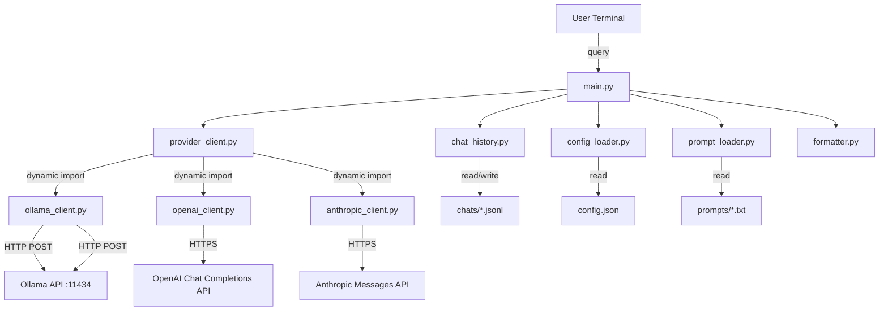

# Architecture

## Overview

KIO1 Orchestrator is a terminal application that accepts natural-language user requests and produces structured JSON workflow plans. It routes tasks to specialized KIO agents (KIO2–KIO13) by leveraging a local Ollama LLM instance.

## System Diagram

## Components

| Module | Responsibility |
|--------|---------------|
| `main.py` | Entry point; REPL loop, orchestrates all other modules |
| `config_loader.py` | Loads and validates `config.json` into a typed `Config` dataclass |
| `provider_client.py` | Dynamically imports `<provider>_client.py` and validates it implements the required provider interface |
| `prompt_loader.py` | Reads system prompt text from disk |
| `ollama_client.py` | Sends HTTP requests to the Ollama `/api/chat` endpoint |
| `openai_client.py` | Sends requests via the OpenAI Chat Completions API |
| `anthropic_client.py` | Sends requests via the Anthropic Messages API |

| `chat_history.py` | Manages JSONL-based conversation persistence |
| `formatter.py` | Pretty-prints JSON responses for terminal display |

## Data Flow

1. On startup, configuration and system prompt are loaded.
2. The configured provider's model is preloaded (Ollama loads it into memory with `keep_alive: -1`; OpenAI and Anthropic verify the model exists — a no-op cost-wise otherwise, since they're hosted APIs).
3. A new JSONL chat file is created for the session.
4. The REPL loop reads user input, loads prior messages from the chat file, sends the full conversation to Ollama, and displays the formatted JSON workflow plan.
5. Both user and assistant messages are appended to the chat file after each exchange.

## Design Decisions

- **No external HTTP library**: Uses `urllib.request` from the standard library to minimize dependencies.
- **JSONL chat storage**: Each message is a single JSON line, enabling append-only writes and simple streaming reads.
- **Model preloading**: The model is loaded into Ollama memory at startup with `keep_alive: -1` (indefinite) to eliminate cold-start latency on the first query.
- **JSON-forced output**: The Ollama request includes `"format": "json"` to guarantee structured responses from the model.
