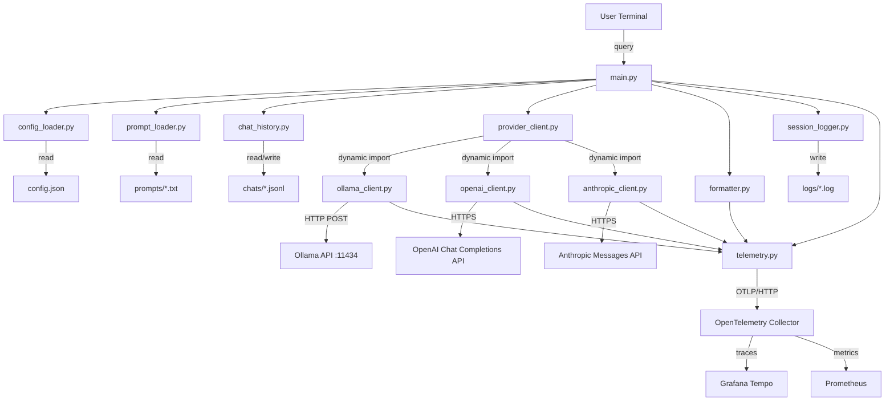

# Architecture

## Overview

KIO1 Orchestrator is a terminal application that accepts natural-language user requests and produces structured JSON workflow plans. It supports Ollama, OpenAI, and Anthropic through dynamically loaded provider modules. Optional OpenTelemetry instrumentation exports privacy-safe traces and metrics.

## System Diagram

```mermaid
graph TD
    User[User Terminal] -->|query| Main[main.py]
    Main --> ConfigLoader[config_loader.py]
    Main --> PromptLoader[prompt_loader.py]
    Main --> ChatHistory[chat_history.py]
    Main --> ProviderClient[provider_client.py]
    Main --> Formatter[formatter.py]
    Main --> SessionLogger[session_logger.py]
    Main --> Telemetry[telemetry.py]
    SessionLogger -->|write| LogFiles[logs/*.log]
    ProviderClient -->|dynamic import| OllamaClient[ollama_client.py]
    ProviderClient -->|dynamic import| OpenAIClient[openai_client.py]
    ProviderClient -->|dynamic import| AnthropicClient[anthropic_client.py]
    OllamaClient -->|HTTP POST| Ollama[Ollama API :11434]
    OpenAIClient -->|HTTPS| OpenAIAPI[OpenAI Chat Completions API]
    AnthropicClient -->|HTTPS| AnthropicAPI[Anthropic Messages API]
    ChatHistory -->|read/write| ChatFiles[chats/*.jsonl]
    ConfigLoader -->|read| ConfigFile[config.json]
    PromptLoader -->|read| PromptFile[prompts/*.txt]
    Formatter --> Telemetry
    OllamaClient --> Telemetry
    OpenAIClient --> Telemetry
    AnthropicClient --> Telemetry
    Telemetry -->|OTLP/HTTP| Collector[OpenTelemetry Collector]
    Collector -->|traces| Tempo[Grafana Tempo]
    Collector -->|metrics| Prometheus[Prometheus]
```

## Components

| Module | Responsibility |
|--------|---------------|
| `main.py` | Entry point; REPL loop, orchestrates all other modules |
| `config_loader.py` | Loads and validates `config.json` into a typed `Config` dataclass |
| `session_logger.py` | Per-session log file setup and duration measurement |
| `provider_client.py` | Dynamically imports `<provider>_client.py` and validates it implements the required provider interface |
| `prompt_loader.py` | Reads system prompt text from disk |
| `ollama_client.py` | Sends HTTP requests to the Ollama `/api/chat` endpoint |
| `openai_client.py` | Sends requests via the OpenAI Chat Completions API |
| `anthropic_client.py` | Sends requests via the Anthropic Messages API |
| `chat_history.py` | Manages JSONL-based conversation persistence |
| `formatter.py` | Pretty-prints JSON responses for terminal display |
| `telemetry.py` | Initializes OpenTelemetry, creates spans and metrics, records metadata, and flushes exporters |
| `observability/` | Defines the persistent Collector, Tempo, and Prometheus services |

## Data Flow

1. A session ID is generated, logging is initialized, and configuration is loaded.
2. OpenTelemetry is initialized when `telemetry.enabled` is `true`.
3. The system prompt and configured provider are loaded, and the model is preloaded or validated inside the startup trace.
4. A new JSONL chat file is created and the session-started metric is recorded.
5. Each user request runs inside a turn trace containing the provider request and response-formatting spans.
6. Provider response metadata, token usage, workflow structure, and request durations are recorded without prompt or response content.
7. User and assistant messages are appended to the chat file after each exchange.
8. On exit, the session-completed metric is recorded and pending telemetry is flushed.

## Design Decisions

- **Standard-library Ollama client**: Ollama requests use `urllib.request`, avoiding an additional provider-specific HTTP dependency.
- **JSONL chat storage**: Each message is a single JSON line, enabling append-only writes and simple streaming reads.
- **Model preloading**: The model is loaded into Ollama memory at startup using configured `keep_alive` to reduce cold-start latency.
- **JSON-forced output**: The Ollama request includes `"format": "json"` to guarantee structured responses from the model.
- **Per-session logging**: Each run writes `logs/log_<session_id>.log` at `DEBUG`, paired with its `chats/chat_<session_id>.jsonl` by a shared id. Only `ERROR` reaches the console, keeping interactive output clean.
- **Message content at DEBUG only**: `INFO` records carry metadata (provider, model, durations, token counts); user queries and model responses appear only at `DEBUG`, which never reaches stderr.
- **Optional telemetry**: OpenTelemetry is disabled by default, allowing KIO1 to run without Docker or a Collector.
- **Privacy-aware instrumentation**: Telemetry contains operational metadata but excludes prompts, responses, exception messages, and stack traces.
- **Persistent observability storage**: Collector queues, Tempo traces, and Prometheus metrics use named Docker volumes that survive container recreation.

