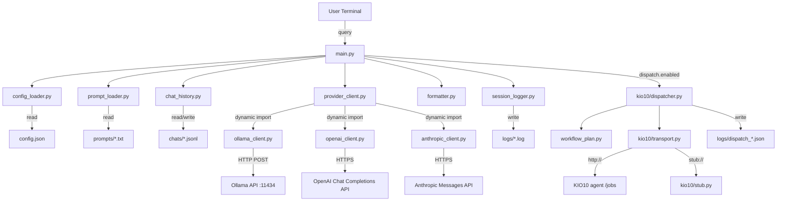

# Architecture

## Overview

KIO1 Orchestrator is a terminal application that accepts natural-language user requests and produces structured JSON workflow plans. It routes tasks to specialized KIO agents (KIO2–KIO13) by leveraging a local Ollama LLM instance.

## System Diagram

```mermaid
graph TD
    User[User Terminal] -->|query| Main[main.py]
    Main --> ConfigLoader[config_loader.py]
    Main --> PromptLoader[prompt_loader.py]
    Main --> ChatHistory[chat_history.py]
    Main --> ProviderClient[provider_client.py]
    Main --> Formatter[formatter.py]
    Main --> SessionLogger[session_logger.py]
    Main -->|dispatch.enabled| Dispatcher[kio10/dispatcher.py]
    Dispatcher --> WorkflowPlan[workflow_plan.py]
    Dispatcher --> KIO10Transport[kio10/transport.py]
    KIO10Transport -->|http://| KIO10[KIO10 agent /jobs]
    KIO10Transport -->|stub://| KIO10Stub[kio10/stub.py]
    Dispatcher -->|write| ReportFiles[logs/dispatch_*.json]
    SessionLogger -->|write| LogFiles[logs/*.log]
    ProviderClient -->|dynamic import| OllamaClient[ollama_client.py]
    ProviderClient -->|dynamic import| OpenAIClient[openai_client.py]
    ProviderClient -->|dynamic import| AnthropicClient[anthropic_client.py]
    OllamaClient -->|HTTP POST| Ollama[Ollama API :11434]
    OpenAIClient -->|HTTPS| OpenAIAPI[OpenAI Chat Completions API]
    AnthropicClient -->|HTTPS| AnthropicAPI[Anthropic Messages API]
    ChatHistory -->|read/write| ChatFiles[chats/*.jsonl]
    ConfigLoader -->|read| ConfigFile[config.json]
    PromptLoader -->|read| PromptFile[prompts/*.txt]
```

## Components

| Module | Responsibility |
|--------|---------------|
| `main.py` | Entry point; REPL loop, orchestrates all other modules |
| `config_loader.py` | Loads and validates `config.json` into a typed `Config` dataclass |
| `session_logger.py` | Per-session log file setup and duration measurement |
| `provider_client.py` | Dynamically imports `<provider>_client.py` and validates it implements the required provider interface |
| `prompt_loader.py` | Reads system prompt text from disk |
| `ollama_client.py` | Sends HTTP requests to the Ollama `/api/chat` endpoint |
| `openai_client.py` | Sends requests via the OpenAI Chat Completions API |
| `anthropic_client.py` | Sends requests via the Anthropic Messages API |
| `chat_history.py` | Manages JSONL-based conversation persistence |
| `formatter.py` | Pretty-prints JSON responses for terminal display |
| `workflow_plan.py` | Parses a plan into typed steps with explicit `depends_on`; rejects cycles and unknown dependencies |
| `kio10/dispatcher.py` | Runs plan steps as `asyncio` tasks ordered by dependencies, passes artifacts downstream, builds the report |
| `kio10/transport.py` | KIO1 ↔ KIO10 message contract: request builder, submit-and-poll loop, HTTP transport over `httpx2` |
| `kio10/stub.py` | In-memory KIO10 stand-in speaking the same contract, for exercising the chain without real agents |

## Data Flow

1. A session id is generated and logging is initialized, then configuration and the system prompt are loaded.
2. The configured provider's model is preloaded (Ollama loads it into memory with `keep_alive: -1`; OpenAI and Anthropic verify the model exists — a no-op cost-wise otherwise, since they're hosted APIs).
3. A new JSONL chat file is created for the session.
4. The REPL loop reads user input, loads prior messages from the chat file, sends the full conversation to Ollama, and displays the formatted JSON workflow plan.
5. Both user and assistant messages are appended to the chat file after each exchange.
6. The plan is validated by `workflow_plan.py` and a one-line `Plan check` verdict is printed under it. The model's JSON is printed unchanged so that it stays comparable with the `kio1.evals` results.
7. When `dispatch.enabled` is set and the check passed, each step is sent to its agent in dependency order, and a per-step report is printed and stored as `logs/dispatch_<session_id>_<workflow_id>.json`. See [Dispatch](dispatch.md).

## Design Decisions

- **No external HTTP library**: Uses `urllib.request` from the standard library to minimize dependencies.
- **JSONL chat storage**: Each message is a single JSON line, enabling append-only writes and simple streaming reads.
- **Model preloading**: The model is loaded into Ollama memory at startup using configured `keep_alive` to reduce cold-start latency.
- **JSON-forced output**: The Ollama request includes `"format": "json"` to guarantee structured responses from the model.
- **Per-session logging**: Each run writes `logs/log_<session_id>.log` at `DEBUG`, paired with its `chats/chat_<session_id>.jsonl` by a shared id. Only `ERROR` reaches the console, keeping interactive output clean.
- **Dispatch off by default**: the terminal application is unchanged unless `dispatch.enabled` is set. Steps addressed to agents absent from `dispatch.agents` are reported as skipped, not as errors.
- **Dependencies drive concurrency**: each step is an `asyncio` task that awaits the tasks it depends on, so independent steps run together whenever a plan carries `depends_on`. Until the system prompt is taught to emit it, plans run by `execution_mode` alone and `mixed` falls back to `sequential`.
- **Only the KIO10 contract is fixed**: the dispatcher requires nothing beyond the envelope of the KIO1 – KIO10 integration document. Polling reuses the acknowledgement while a job runs, so no new status was introduced.
- **Message content at DEBUG only**: `INFO` records carry metadata (provider, model, durations, token counts); user queries and model responses appear only at `DEBUG`, which never reaches stderr.

